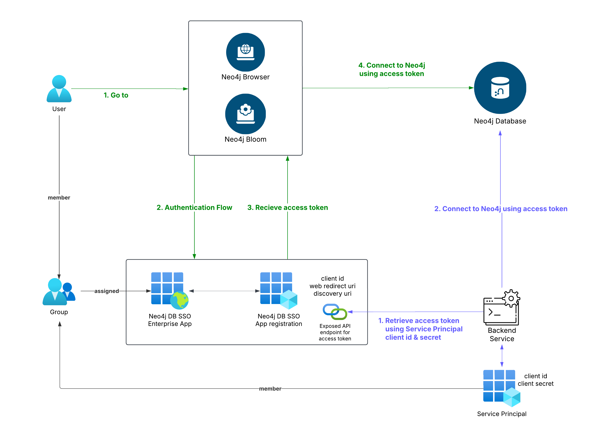

# Neo4j SSO with Python & EntraID

This repository is to demonstrate how to connect to a Neo4j database using the python driver via SSO. 

## Installation and Setup

1. Create a `.env` file and fill-in the environment variables as shown in the `example.env`

2. Install the libraries listed in `requirements.txt`.
```bash
pip install -r requirements.txt
```

## Using SSO for a backend Service with EntraID
In order to allow our python backend to connect to Neo4j using SSO we need to create a technical account (aka Service Principal) that will be used by our script. For this example, we will use a client secret to get a token on behalf of our application. 

This client id & secret are configured in your service principal and we have given it permission in the Neo4j application so it can access our exposed api and get the token to connect. We are also assigning this principal to an existing AD group, Neo4j will use this group membership to determine the authorization this service principal has to query the database.

